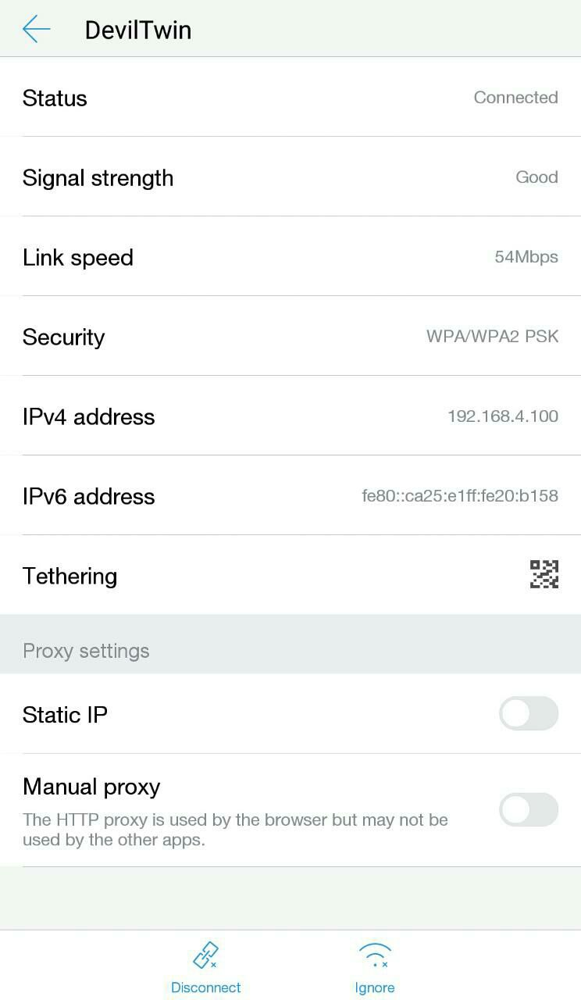
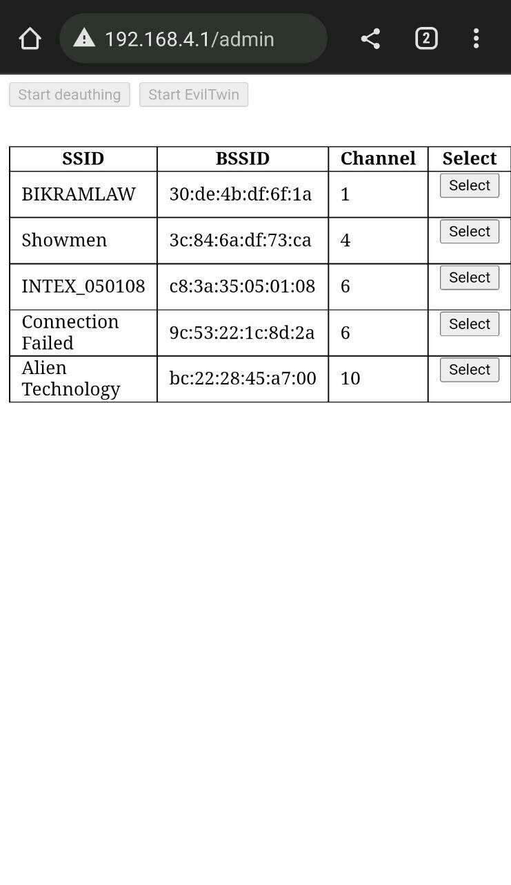

    
	 

# DevilTwin NodeMCU
**Project Introduction:**
Welcome to the DevilTwin project, an educational demonstration that replicates the concept of an Evil Twin Attack. Through this project, we showcase how vulnerabilities in the Wi-Fi protocol (specifically WPA/WPA2) can potentially allow unauthorized access to a network. Leveraging the capabilities of the ESP8266 and utilizing the Arduino framework, we create a simple yet effective platform to illustrate how data can be intercepted from a Wi-Fi network.

**Project Overview:**
The DevilTwin project mimics the operation of an Evil Twin Attack, a security exploit where an attacker sets up a rogue wireless access point to impersonate a legitimate network. Clients unknowingly connect to this malicious access point, potentially exposing sensitive information. This project highlights the risks associated with this kind of attack and serves as an educational tool to better understand the implications of Wi-Fi vulnerabilities.

**Attack Methodology:**
The project capitalizes on a weakness in the Wi-Fi protocol by continuously de-authenticating clients from a targeted Wi-Fi network. This is achieved through a technique that forces the clients to disconnect from the legitimate access point. Subsequently, when the clients attempt to reconnect, a 4-way handshake is captured, which contains critical information needed for authentication. By analyzing and potentially brute-forcing this handshake, the attacker can potentially obtain the network's password.

**ESP8266 and Arduino Framework:**
The ESP8266, a popular Wi-Fi module, is the foundation of this project. Leveraging the Arduino framework, we program the ESP8266 to function as both an access point and a client, allowing us to simulate the attack in a controlled environment. The Arduino framework simplifies the development process and provides an accessible platform for demonstrating complex concepts.

**Faking a Firmware Update Page:**
One unique aspect of the DevilTwin project is its ability to deceive users with a fake firmware update page. When users attempt to connect to the rogue access point, they are presented with a convincing page prompting them to enter the Wi-Fi password. Unbeknownst to them, this input is captured by the malicious device.

**User Interaction and Feedback:**
The project manipulates user perception by providing feedback on password attempts. When a user enters a password, whether correct or incorrect, the project responds accordingly. If an incorrect password is entered, the user is informed that the password is incorrect and is redirected to the same page, leading them to believe they made a mistake. This technique increases the likelihood of obtaining the correct password by encouraging users to re-enter it.

**Admin Page and Data Display:**
The project features an admin page accessible through the ESP8266's web server. This page displays the captured passwords, revealing the extent of the vulnerability. Even incorrect passwords entered by users are stored and displayed, further demonstrating the efficacy of this social engineering technique.

**Educational Purpose:**
It is important to emphasize that the DevilTwin project is designed solely for educational purposes. By replicating the mechanics of an Evil Twin Attack, we aim to raise awareness about Wi-Fi vulnerabilities and promote responsible cybersecurity practices. The project serves as a cautionary example of how easily sensitive data can be compromised if proper security measures are not in place.

**Ethical Considerations:**
We strongly emphasize that the DevilTwin project should only be used in ethical and legal contexts. Unauthorized access to Wi-Fi networks or any form of malicious intent is strictly prohibited. This project is intended to foster a better understanding of security risks and encourage individuals to prioritize network security and protection.

Remember, knowledge is a powerful tool, and responsible use of technology is essential for a safer digital world.

> Use this tool only on networks that you have permission for.

## Change Log

- Removed AsyncWebServer due to performance and stability
- Reworked deauthing - now it changes channel so deauthing can work properly

> Note: This Project Is Licensed Under MIT License and Is Only for Educational Purposes. I Am Not Responsible for Any Misuse of This Project.

## Installation (ESP8266 Flasher - Easy way)

1. Download **[ESP8266 Flasher](https://github.com/nodemcu/nodemcu-flasher)**.

2. Download the **[DevilTwin-NodeMCU.ino.bin](https://github.com/JacksVault/DevilTwin-NodeMCU/raw/main/DevilTwin-NodeMCU/build/esp8266.esp8266.generic/DevilTwin-NodeMCU.ino.bin)** file.

3. Open the ESP8266 Flasher and select the Node MCU port

4. Then, go to the config tab and select the .bin file you've just downloaded.

5. Finally, go back to the first tab and press "Flash"

6. Your Node MCU is ready!

# Installation (Arduino IDE)

1. Open your <a href="https://www.arduino.cc/en/main/software">Arduino IDE</a> and go to "File -> Preferences -> Boards Manager URLs" and paste the following links (You Can Use Multiple Links Separated By Commas): ``https://dl.espressif.com/dl/package_esp32_index.json, http://arduino.esp8266.com/stable/package_esp8266com_index.json``

2.  Go to "Tools -> Board -> Boards Manager", search "esp8266" and install esp8266

3.  Then Go To "Tools -> Manage Libraries", search "Senses_wifi" and install `Senses_wifi`

4. Go to "Tools -> Board" and select your board

5. Download and open the sketch "<a href="https://github.com/JacksVault/DevilTwin-NodeMCU/blob/main/DevilTwin-NodeMCU/DevilTwin-NodeMCU.ino"><b>DevilTwin-NodeMCU.ino</b></a>"

6. You can optionally change some parameters like the SSID name and texts of the page like title, subtitle, text body etc.

7. Upload the code into your board.

8. You are done!

> Note: Deauthing might not work on some phones due to the fact that this project uses broadcast as station target (attacks everyone on network and not specific client).

  

#  Usage Instructions

  

1. Connect to the AP named "DevilTwin" with password "12345678" from your phone/PC.

2. Select the target you want (list of available APs refreshes every 30secs - page reload is required)

  

3. Click the Start Evil-Twin button and reconnect to the newly created AP named same as your target (will be open)

4. After connecting, make sure you choose "Use this network as is" (may differ on different devices)

5. Go to your favorite browser and navigate to ``192.168.4.1/admin``

6. Once there DO NOT change your target, only start/stop deauthing and wait for someone to try and use the correct password.

7. If the user enters a password, and the password does't matches the handshake file, an error message will be shown to the user and the user will be asked to enter the correct password.

8. Once correct password is found, AP will be restarted with default ssid "DevilTwin" with password "12345678" and at the bottom of a table you should be able to see something like "Successfully got password for - SSID - Password

> If you have any questions, feel free to post in the issues section